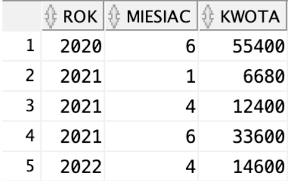

# Oracle-database-project
> Final project for Databases subject at Military University of Technology in Warsaw

## Business analysis of the designed reality
I chose an online computer store as my subject. It sells items in the categories of Laptops and Computers, Smartphones and Smartwatches, Gaming, Computer Components or Peripherals. 
In the store's database, information about orders, customers, products, categories, employees, customer addresses, receipts and receipt items is stored in tables. 
As part of the business analysis, I developed 4 perspectives that implement the display of the store's offerings, the display of earnings by month, the display of best-selling brands and the list of cities from which customers placed the most orders.

## Database creation software
Oracle Data Modeler was used to create a relational model and a logical model. 
Oracle SQL Developer was used to execute and prepare SQL statements responsible for creating tables, sequences and perspectives, as well as deleting them and populating the tables with data. 

## Logical and relational model of the database

## Instructions for project installation
Deployment scripts that install (creates tables and also inserts data to the tables) and uninstall the project are in .sql files. 
To install the project, copy the code snippets of interest to Oracle SQL Developer connected to the server, and then execute the sentences with the green button.

## Showcase of perspectives
"wyswietl_cala_oferte” (show full offer) perspective:  

"zarobki_wedlug_miesiecy” (earnings by month) perspective:  

"najlepiej_sprzedajace_sie_marki” (best-selling brands) perspective:  

"miasta_najwiecej_zamowien” (highest orders by city) perspective:  

